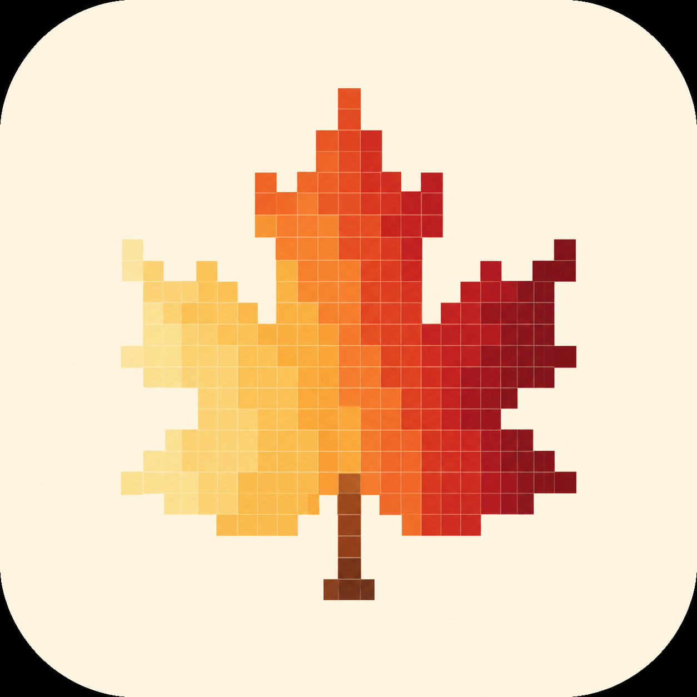

<p align="center">
  
</p>

<h1 align="center">tency</h1>

<p align="center"><em>Show up. Color the grid.</em></p>

<p align="center">
  A private, colorful, minimalist habit tracker for iOS — heatmap-first, widget-driven, themeable.
</p>

---

## What is tency?

**tency** (short for *consistency*) is a personal habit tracker built to make "did I do it today?" instantly visible on your Home Screen. The headline is a satisfying, GitHub-style **heatmap** that's so rewarding to fill in that checking the app feels like a win.

Single-user, local-first, no accounts, no sync, no App Store — just you and the grid.

## Features

- **Heatmap calendar grid** — year-view, scrollable; intensity reflects how much you did.
- **Home Screen widgets (S/M/L)** — per-habit, interactive tap-to-check-in via AppIntents.
- **Track amounts** — minutes, counts, or a custom unit; heatmap intensity scales with amount vs. target.
- **Streaks & consistency** — current streak, best streak, % over a window.
- **Local reminders** — per-habit time and days-of-week, all on-device.
- **Multiple habits + categories** — group and organize.
- **Per-habit colors** — pick from the active theme's palette.
- **Themes** — Gruvbox (Dark/Light), Catppuccin (Mocha/Latte), Nord, Tokyo Night, Rosé Pine, System. Light & dark fully themed.
- **Local JSON export** — backup to the Files app (no cloud).

## Tech Stack

| Layer | Choice |
|---|---|
| Language | Swift 6.1 (strict concurrency) |
| UI | SwiftUI (iOS 17+ APIs) |
| Persistence | SwiftData |
| Widgets | WidgetKit + AppIntents |
| Notifications | UNUserNotificationCenter (local) |
| Charts (later) | Swift Charts |
| Project gen | XcodeGen (`project.yml`) |
| Formatting / Lint | swift-format · SwiftLint |
| Min iOS target | iOS 17.0 |

## Project Structure

```
tency/
├── project.yml          # XcodeGen spec
├── Tency/               # Main iOS app target
│   ├── App/             # @main, navigation root
│   ├── Features/        # HabitList, Heatmap, HabitDetail, AddHabit, Categories, Settings, Themes
│   └── Resources/       # Assets, app icon
├── TencyWidget/         # Widget extension (interactive tap-to-checkin)
├── TencyShared/         # Shared package: models, themes, heatmap logic
└── Tests/
```

App ↔ Widget data sharing via App Group `group.com.divs.tency` with a shared SwiftData store.

## Build & Run

Requires Xcode and the XcodeGen / formatting toolchain. Common tasks live in the [`Makefile`](Makefile):

```bash
make gen      # regenerate the .xcodeproj from project.yml
make build    # build (pretty-printed via xcbeautify)
```

Open `Tency.xcodeproj` in Xcode, select your device/simulator, and run.

> **Note:** Signing with a free Apple ID expires every 7 days — re-deploy weekly via Xcode for on-device use.

## Status

Personal project for single-user use. See [`PROJECT_PLAN.md`](PROJECT_PLAN.md) for the full spec, theme system, and roadmap.
